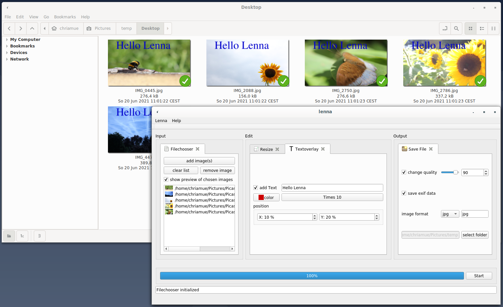

# lenna [![Build Status][travis-image]][travis] [![Documentation][codedocs-image]][codedocs] [![Release][release-image]][releases] [![License][license-image]][license] [](https://snapcraft.io/lenna)
==============

*Open Source Image Processing Program*

Program to batch compress, resize and rename Images.

This project is using Qt5 and OpenCV.

[travis-image]: https://travis-ci.com/lenna-project/lenna.svg?branch=main
[travis]: https://travis-ci.com/lenna-project/lenna

[codedocs-image]: https://codedocs.xyz/lenna-project/lenna.svg?branch=main
[codedocs]: https://codedocs.xyz/lenna-project/lenna/

[release-image]: https://img.shields.io/github/v/release/lenna-project/lenna?branch=main
[releases]: https://github.com/lenna-project/lenna/releases

[license-image]: https://img.shields.io/github/license/lenna-project/lenna?branch=main
[license]: LICENSE



## Features

* Drag and drop images
* convert images to formats like png, bmp, tiff or jpeg
* batch convert folders

The App is extendable by plugins.

* resize
* rotate
* crop
* rename
* textoverlay
* folders

## Quick start

First install CMake, Qt5, OpenCV.

Then build and run.

```sh
git clone https://github.com/lenna-project/lenna
cd lenna
mkdir build
cd build
cmake ..
make
./bin/lenna
```

### Packages

```sh
make pack
```

#### SNAP Package
```sh
make snap
```

## Contribute

Contributions are always welcome!

## 📜 License

This software is licensed under the [MIT](https://github.com/lenna-project/lenna/blob/main/LICENSE) © [lenna-project](https://github.com/lenna-project).
